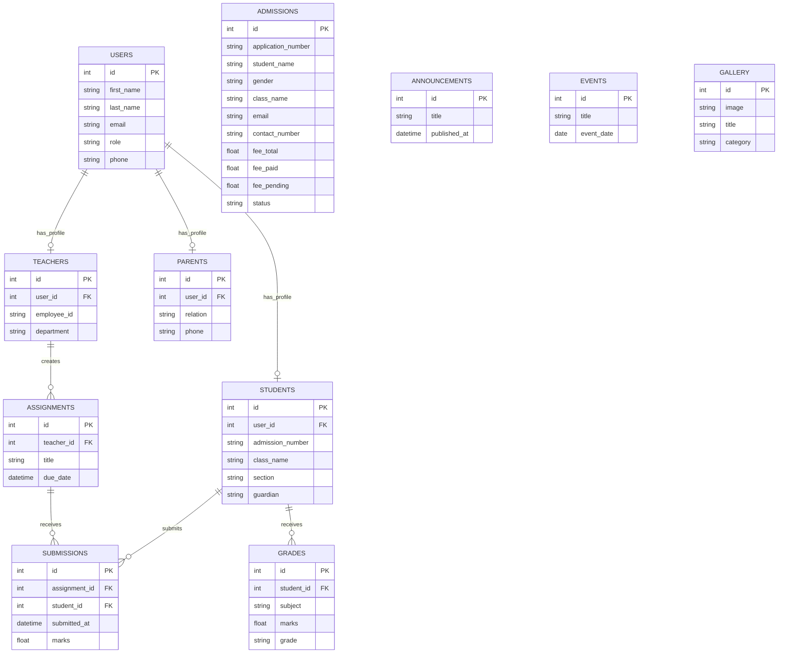

# API Usage Guide

## Base URL

- Local backend: `http://localhost:8000`
- Versioned API prefix: `/api/v1`

## Authentication Flow

### Login

`POST /api/v1/auth/login`

Demo logins are seeded with password `Demo@1234`:

- `admin@school.example.com` for administrator access
- `principal@school.example.com` for principal access

Request body:

```json
{
  "email": "admin@school.example.com",
  "password": "Demo@1234"
}
```

Response body:

```json
{
  "tokens": {
    "access_token": "...",
    "refresh_token": "...",
    "token_type": "bearer",
    "expires_in": 1800
  },
  "user": {
    "id": 1,
    "first_name": "System",
    "last_name": "Admin",
    "email": "admin@school.example.com",
    "role": "administrator"
  }
}
```

### Refresh Token

`POST /api/v1/auth/refresh-token`

Request body:

```json
{
  "refresh_token": "..."
}
```

### Password Reset

- `POST /api/v1/auth/forgot-password`
- `POST /api/v1/auth/reset-password`

## Authorization Header

Use JWT access token in request headers:

`Authorization: Bearer <access_token>`

## Pagination, Sorting, and Search

Most list endpoints support these query params:

- `page` (default `1`)
- `size` (default `20`, max `100`)
- `sort` (example `id`, `-id`, `event_date`)
- `search` (string filter across configured fields)

Example:

`GET /api/v1/students?page=1&size=20&sort=-id&search=ADM-2026`

Standard list response shape:

```json
{
  "items": [],
  "page": 1,
  "size": 20,
  "total": 0
}
```

## Module Endpoint Summary

| Module | Base Path | Notes |
| --- | --- | --- |
| Auth | `/api/v1/auth` | Login, refresh, logout, forgot/reset password |
| Users | `/api/v1/users` | CRUD with role restrictions |
| Students | `/api/v1/students` | CRUD + pagination/search |
| Teachers | `/api/v1/teachers` | CRUD + pagination/search |
| Parents | `/api/v1/parents` | CRUD + pagination/search |
| Admissions | `/api/v1/admissions` | CRUD for applications |
| Grades | `/api/v1/grades` | Grade create/edit/list |
| Assignments | `/api/v1/assignments` | Assignment create/edit/list |
| Submissions | `/api/v1/submissions` | Submission create/list |
| Events | `/api/v1/events` | Event scheduling |
| Gallery | `/api/v1/gallery` | Gallery image metadata |
| Announcements | `/api/v1/announcements` | Publish/read announcements |
| Dashboard | `/api/v1/dashboard` | Role-based metrics |
| Files | `/api/v1/files` | Upload/download file handling |

## API Docs

- OpenAPI UI: `/docs`
- ReDoc: `/redoc`

## Backend Entity Relationship Diagram


