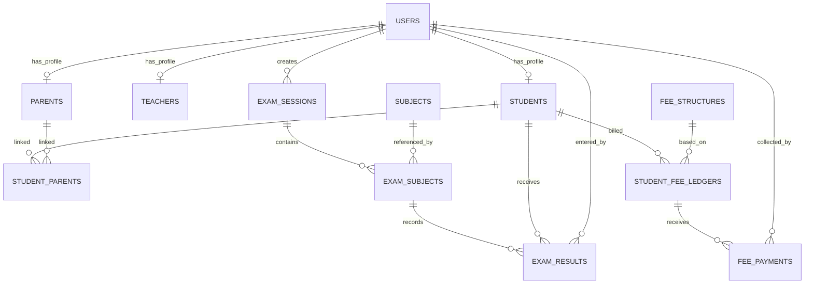

# Management, Fees, Academics, and Exams Architecture

## Goal

Evolve the current modular monolith to support:

1. Student-parent linking.
2. Admin/Principal-only Management navigation and workflows.
3. Periodic exams with subject-level marks tracking.
4. CampusInHand-style module parity for Fees, Teacher Management, and Academics/Exams.

This design fits the current stack:
- Backend: FastAPI + SQLAlchemy + Alembic
- Frontend: React + Router + React Query
- DB: PostgreSQL

## Architecture Principles

1. Keep a modular monolith, but introduce clear domain modules and service boundaries.
2. Use explicit relational tables for workflows (avoid JSON blobs for core business entities).
3. Separate role identity from permissions to support future granularity.
4. Build management UX around domain-specific APIs and scoped write permissions.
5. Make analytics queryable from normalized structures (fees/exams/subjects) rather than computed from ad-hoc fields.

## Capability Map

### Management Module (Admin + Principal only)
- User Management:
  - Modify logged user details
  - Change role (with policy restrictions)
  - Activate/deactivate users
- Content Management:
  - CRUD: Announcements
  - CRUD: Events
  - CRUD: Gallery
- Teacher Management:
  - Teacher profiles
  - Subject assignment
  - Class teacher mapping
- Fee Management:
  - Fee structures
  - Student fee ledgers
  - Payments, dues, receipts
- Academics and Exams:
  - Subjects catalog
  - Exam sessions (periodic)
  - Exam papers by subject
  - Student exam results

## Navigation Information Architecture

Add a new top-level dropdown visible only to administrator/principal:

- Management
  - Users
    - Profile & Access
    - Roles & Status
  - Content
    - Announcements
    - Events
    - Gallery
  - Academics
    - Subjects
    - Class-Subject Mapping
  - Exams
    - Exam Sessions
    - Result Entry
    - Result Reports
  - Fees
    - Fee Structures
    - Student Ledgers
    - Payments & Dues
  - Teachers
    - Teacher Profiles
    - Assignments

UI policy:
- Hide Management nav entirely for non-admin/principal roles.
- Gate write actions by backend permission checks; frontend is only a convenience guard.

## Authorization Model

Current model is role-based only. Keep roles but add permission claims for management actions.

### Suggested Permission Keys
- users.read, users.write, users.role.change, users.deactivate
- content.announcements.write, content.events.write, content.gallery.write
- academics.subjects.write, academics.mapping.write
- exams.sessions.write, exams.results.write
- fees.structures.write, fees.ledger.write, fees.payments.write
- teachers.write, teachers.assignment.write

### Role Baseline
- administrator: all permissions
- principal: all management except destructive platform-level actions (optional policy)
- teacher/student/parent: read-only to own scope; no management writes

## Data Model Changes

### 1) Student-Parent Linking

Current schema has separate students and parents with no relational link.

Add junction table:
- student_parents
  - id PK
  - student_id FK -> students.id (CASCADE)
  - parent_id FK -> parents.id (CASCADE)
  - relationship_type (mother/father/guardian/other)
  - is_primary boolean
  - created_at, updated_at

### 2) Exams Domain (Normalized)

Add subject master:
- subjects
  - id PK
  - code unique
  - name
  - description
  - is_active
  - created_at, updated_at

Add exam session:
- exam_sessions
  - id PK
  - name (Mid Term 2026, Quarterly 1, etc.)
  - academic_year (int)
  - term (optional)
  - start_date
  - end_date
  - status (draft/published/closed)
  - created_by_user_id FK -> users.id
  - created_at, updated_at

Add exam-paper-level subject linkage:
- exam_subjects
  - id PK
  - exam_session_id FK -> exam_sessions.id (CASCADE)
  - subject_id FK -> subjects.id (RESTRICT)
  - class_name
  - max_marks
  - exam_date
  - created_at, updated_at

Add student result entries:
- exam_results
  - id PK
  - exam_subject_id FK -> exam_subjects.id (CASCADE)
  - student_id FK -> students.id (CASCADE)
  - obtained_marks
  - grade_label
  - remarks
  - entered_by_user_id FK -> users.id
  - created_at, updated_at
  - unique constraint (exam_subject_id, student_id)

### 3) Fee Management (Recommended)

Current admission-level fee fields are useful at application stage, but not enough for student fee lifecycle.

Add:
- fee_structures
  - id PK
  - class_name
  - academic_year
  - amount_total
  - due_schedule_json (or normalize into installments)
  - created_at, updated_at

- student_fee_ledgers
  - id PK
  - student_id FK -> students.id
  - fee_structure_id FK -> fee_structures.id
  - total_amount
  - paid_amount
  - pending_amount
  - status (pending/partial/paid/overdue)
  - created_at, updated_at

- fee_payments
  - id PK
  - ledger_id FK -> student_fee_ledgers.id
  - amount
  - paid_on
  - mode (cash/card/upi/bank)
  - reference_no
  - collected_by_user_id FK -> users.id
  - created_at, updated_at

## ER Diagram (Target)

## Backend Module Layout (Recommended)

Add new domain packages:
- backend/app/models/subject.py
- backend/app/models/exam_session.py
- backend/app/models/exam_subject.py
- backend/app/models/exam_result.py
- backend/app/models/student_parent.py
- backend/app/models/fee_structure.py
- backend/app/models/student_fee_ledger.py
- backend/app/models/fee_payment.py

Add APIs and services:
- backend/app/api/subjects.py
- backend/app/api/exams.py
- backend/app/api/fees.py
- backend/app/api/management.py
- backend/app/services/exams_service.py
- backend/app/services/fees_service.py
- backend/app/services/management_service.py

## API Surface (Proposed)

### Management
- GET /api/v1/management/users
- PATCH /api/v1/management/users/{id}
- PATCH /api/v1/management/users/{id}/role
- PATCH /api/v1/management/users/{id}/status

### Content
- CRUD under existing:
  - /api/v1/announcements
  - /api/v1/events
  - /api/v1/gallery

### Student-Parent
- POST /api/v1/students/{student_id}/parents/{parent_id}
- DELETE /api/v1/students/{student_id}/parents/{parent_id}
- GET /api/v1/students/{student_id}/parents

### Subjects and Exams
- CRUD /api/v1/subjects
- CRUD /api/v1/exam-sessions
- CRUD /api/v1/exam-subjects
- POST /api/v1/exam-results/bulk
- GET /api/v1/exam-results?exam_session_id=&class_name=&subject_id=

### Fees
- CRUD /api/v1/fee-structures
- CRUD /api/v1/student-fee-ledgers
- POST /api/v1/student-fee-ledgers/{id}/payments
- GET /api/v1/fees/reports?academic_year=&class_name=

## Frontend Architecture Changes

### Feature Modules
- frontend/src/features/management/
  - pages/UsersManagementPage.tsx
  - pages/ContentManagementPage.tsx
  - hooks/useManagementUsers.ts
- frontend/src/features/exams/
  - pages/ExamSessionsPage.tsx
  - pages/ExamResultsEntryPage.tsx
  - pages/ExamReportsPage.tsx
- frontend/src/features/fees/
  - pages/FeeStructuresPage.tsx
  - pages/StudentLedgerPage.tsx
  - pages/PaymentCollectionPage.tsx
- frontend/src/features/subjects/
  - pages/SubjectsPage.tsx

### Routing & Guards
- Add /management/* routes only for administrator/principal via ProtectedRoute.
- Keep backend as source of truth for write permission.

## Migration Strategy (Phased)

### Phase 1: Foundation
1. Add student_parent_links + exams core tables + subject table.
2. Add fee management core tables.
3. Add permission scaffolding and role-policy checks.

### Phase 2: Admin Management UI
1. Add Management nav dropdown.
2. User management + status/role controls.
3. Content management dropdown actions.

### Phase 3: Academics and Exams
1. Subject master and mapping.
2. Exam session builder.
3. Result entry and reports.

### Phase 4: Fees
1. Fee structure definition by class/year.
2. Ledger generation + payment posting.
3. Due reports and dashboard integration.

## Operational & Quality Requirements

- Audit logging for role changes, user deactivation, marks edits, and fee payment edits.
- Soft-delete for user/content entities where recovery matters.
- DB constraints and unique indexes for result integrity.
- Pagination + filtering for all management lists.
- Integration tests:
  - permission matrix tests
  - exam result uniqueness and aggregation
  - fee ledger consistency after payment posting

## Notes on CampusInHand Parity

This architecture intentionally mirrors the module style from CampusInHand reference:
- Fee Management: structures, collection, dues, receipts, reports
- Teacher Management: profile + class/subject mapping
- Academics and Exams: subjects, sessions, results, reports

The implementation remains tailored to your existing codebase and conventions.
